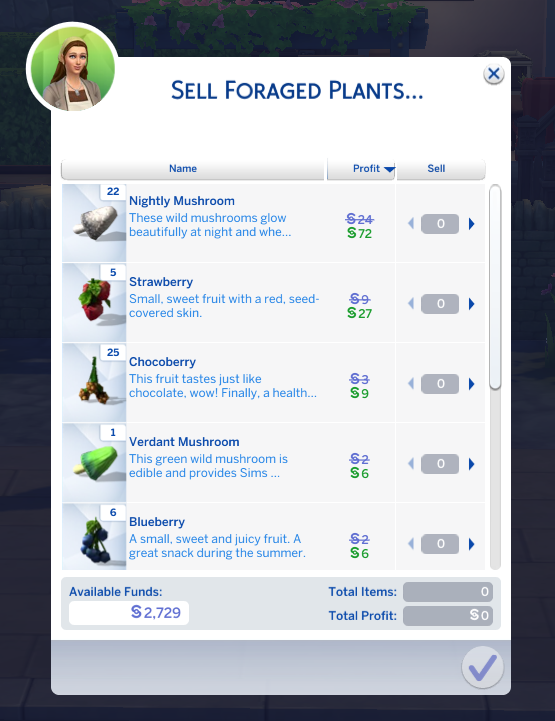
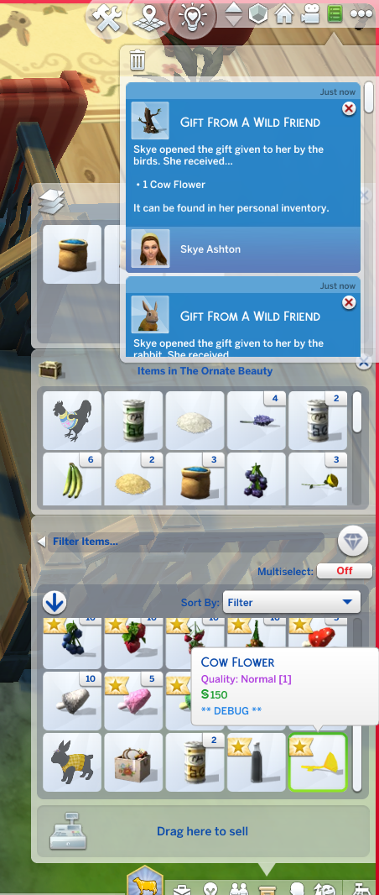

Last time I found out the Creature Keeper buys nightly mushrooms for **a lot** (under Friendly > Sell Foraged Plants). This time I accidently exploited a glitch for that, learned it was glitched, and wasted some money to get rid of some of the extra money I made on acciedent.

You can sell him any number of items, you get the money for all of them, and only 10 of the items will be removed from your inventory. Once I learned this, I put some of the nightly mushroom plants in the household inventory until I only had 2 of them in the garden. That gets me 10 prefectly nightly mushrooms a day (to me the glitch makes it look like he's only supposed to buy 10 items a day, so I'm only selling him 10 items a day).

Even with my 10 items limit, it nets $2k a day, so it's been really helpful.

(even with only normal ones, you still get a lot by selling to the Creature Keeper, just FYI)

We got more wild rabits!

I shall name you Midnight!

And you Snow!

Me & Hannah went to the chicken fair. She got 2nd, but one of her gold eggs got 1st place. Part of the prize for her egg was this outfit. Hansome, but I might put it on that rooster chick in the background once he grows up. (his name is Roostly)

Hello again my good friend!

First oversized produce for this save, and it's a big one! You are not getting thing one Agatha! (I bought a small watermelon from the grocery store for her errand)

So I accidently abused the gitch I described above (and sold some produce more than once), so to compensate I purposely spent money lavishly where I otherwise wouldn't have. So even the rabits got outfits!

Confirmed: Foxes don't steal ONLY eggs. Also apperently I got a new fox? Now sure.

We had a weird glitch happen? I'm not sure. When I tried to put it down on the ground, it seemed to be nothing. So I just sold it to get rid of the debug item.

I bough Hannah a cute sweater.

Everyone was there together when I went shopping, so I went nuts doing errands.

Got an even cuter sweater for Hannah as a reward.

Befriended the new fox

Roostly grew up, and I gave him the hansome outfit that was part of my prize for the chicken fair.

He looks very dashing and adorable.

Got a bunch of new plants, planted them, then golden pulsed everything. Basically I'm keeping out whatever in a category makes me the most money and putting other prefect plants in the household inventory. Both due to lack of space & lack of me wanting to take care of a lot of plants (because good gosh does this tiny farm keep Skye SUPER busy already!).
